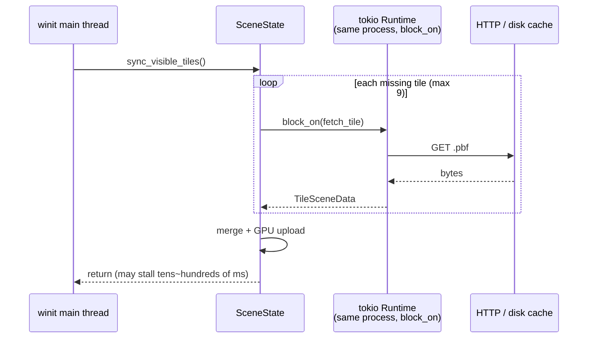
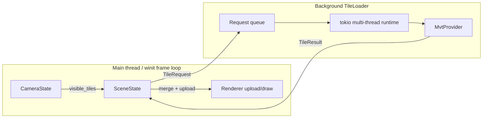
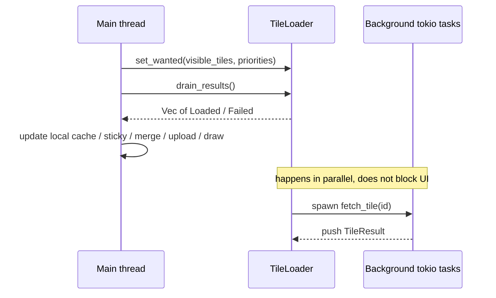

# Phase A: Async Tile Loader Design

> Status: design only (not implemented yet)  
> Scope: move tile downloading off the winit render thread  
> Related code: `apps/native-viewer/src/state/sceneState.rs`, `crates/mw-provider-mvt`

---

## 1. Problem

Every frame, `State::render()` calls `SceneState::sync_visible_tiles()`, which loads missing tiles with:

```text
tokio::Runtime::block_on(provider.fetch_tile(tile_id))
```

This runs on the **winit main thread**. Slow HTTP/decode causes:

- hitches and dropped frames
- sluggish camera pan/orbit
- “blocked frames” in the perf monitor

`mw-provider-mvt` is already async. The bug is the **call site**: synchronous `block_on` on the UI thread.

---

## 2. Goals

| Goal | Meaning |
|------|---------|
| Non-blocking UI | No network `block_on` inside `RedrawRequested` |
| Background download | HTTP + MVT decode on a dedicated async runtime |
| Non-blocking handoff | Main thread only submits requests and drains results |
| Preserve behavior | Keep sticky visibility, same-zoom cache, per-frame throttling |

Non-goals for this phase:

- config module (Phase B)
- render/style abstraction (Phase C)
- PBR / materials

---

## 3. Architecture diagrams

### 3.1 Current (blocking)



### 3.2 Target (async loader)



### 3.3 Per-frame sequence



---

## 4. Proposed module boundaries

```text
apps/native-viewer/
  state/sceneState.rs     # thinner: cache, sticky, merge, upload
  state/state.rs          # frame loop: request → drain → render

crates/mw-provider-mvt/   # unchanged: pure async fetch/decode/map
  or
crates/mw-tile-loader/    # new (preferred): background scheduling + channels
```

Prefer a new `mw-tile-loader` crate (or a `loader` module first) so scheduling logic does not keep growing inside `SceneState`.

### 4.1 Public API sketch

```rust
pub struct TileLoader { /* private: runtime handle + channels */ }

pub enum TileRequest {
    EnsureProvider,
    Fetch(TileId),
    CancelExcept(HashSet<TileId>), // optional: drop in-flight outside view
}

pub enum TileResult {
    ProviderReady { endpoint: String },
    ProviderFailed { error: String },
    Loaded { tile_id: TileId, scene: TileSceneData, elapsed_ms: f64 },
    Failed { tile_id: TileId, error: String },
}

impl TileLoader {
    pub fn new(config: MvtProviderConfig) -> anyhow::Result<Self>;
    pub fn request_tiles(&self, tiles: &[(TileId, u64 /*priority*/)]);
    pub fn drain_results(&self) -> Vec<TileResult>;
    pub fn in_flight(&self) -> usize;
}
```

Main-thread pseudocode:

```rust
loader.request_tiles(&missing_prioritized);
for result in loader.drain_results() {
    match result {
        TileResult::Loaded { tile_id, scene, .. } => cache.insert(tile_id, scene),
        TileResult::Failed { .. } => { /* log; retry later */ }
        _ => {}
    }
}
// merge + upload stay on the main thread (needs wgpu Device/Queue)
```

---

## 5. Rust / ecosystem capabilities used

| Capability | Role | Why |
|------------|------|-----|
| **`tokio` multi-thread runtime** | Run HTTP + decode in background | Already a dependency; `reqwest` needs tokio |
| **`tokio::spawn` / `JoinHandle`** | One async task per tile | Parallel fetches instead of serial `block_on` |
| **`std::sync::mpsc` or `crossbeam_channel` or `tokio::sync::mpsc`** | Main ↔ loader messages | Non-blocking `try_recv` / drain fits a frame loop |
| **`Arc<MvtProvider>`** | Share provider across tasks | Provider is cloneable / shareable after init |
| **`Arc<AtomicUsize>` / semaphore** | Cap in-flight downloads | Replaces today’s `MAX_TILES_PER_SYNC` as a concurrency limit |
| **`Send + 'static` bounds** | Move `TileSceneData` across threads | Forces safe handoff of scene payloads |
| **No main-thread `block_on`** | Keep frame rate alive | The core Phase A constraint |

### 5.1 Channel choice

| Option | Pros | Cons |
|--------|------|------|
| `std::sync::mpsc` | Stdlib, simple | Multi-producer is awkward; backpressure is manual |
| `crossbeam_channel` | Ergonomic, select | Extra dependency |
| `tokio::sync::mpsc` | Fits tokio | Main thread must `try_recv`, never `.await` in the frame loop |

**Phase A recommendation:** `std::sync::mpsc` or `crossbeam_channel`, with main-thread drain via `try_recv`.

### 5.2 Keep GPU on the main thread

Do **not** move `wgpu::Device` / `Queue` into the download thread.

Why:

- wgpu usage is simpler and safer when kept with the thread that owns the surface/frame loop
- uploads must coordinate with swapchain lifetime
- Phase A only fixes network stalls; mesh upload is usually cheap vs HTTP

---

## 6. Trade-offs

### 6.1 Async loader vs keep `block_on`

| | Async loader | Current `block_on` |
|--|--------------|--------------------|
| Frame time | Stable | Stalls on every slow request |
| Complexity | Channels + lifetimes | Short code |
| Debugging | Reordering / races | Easy sequential flow |
| Cancellation | Needs an explicit policy | “done when this frame ends” |

**Decision:** interactive maps need async; the complexity is worth it.

### 6.2 One task per tile vs single worker queue

| | Spawn per tile | Single serial worker |
|--|----------------|----------------------|
| Throughput | High (parallel HTTP) | Low |
| Throttling | Needs a semaphore | Natural |
| Implementation | Slightly harder | Simple |

**Decision:** **bounded concurrency** (e.g. 4–8 in-flight), not unbounded spawn and not fully serial.

### 6.3 Channel results to main cache vs shared `Mutex<HashMap>`

| | Channel back to main | Shared mutex cache |
|--|----------------------|--------------------|
| Ownership | Clear | Lock contention, harder to reason about |
| wgpu upload | Naturally on main | Still needs main-thread upload or locked upload |
| Cancel / sticky | Main thread owns policy | Both sides must understand policy |

**Decision:** download thread only emits `TileResult`; **cache / sticky / merge stay on the main thread** (preserve current `SceneState` semantics).

### 6.4 Cancellation policy

Fast camera motion makes old requests stale.

| Strategy | Notes |
|----------|-------|
| **A. Ignore stale results** (do this first) | Drop result if `tile_id` is not in wanted/sticky |
| B. Cancel `JoinHandle`s | Saves bandwidth; heavier |
| C. Generation / epoch | Discard if `request_gen` mismatches |

Phase A uses **A + optional epoch**.

### 6.5 New crate vs existing crate

| | New `mw-tile-loader` | Inside `mw-provider-mvt` | Inside native-viewer |
|--|----------------------|--------------------------|----------------------|
| Reuse | web-viewer can share | Possible | Hard to reuse |
| Dependency direction | Depends on provider | Provider grows heavier | App stays bloated |
| Clarity | Best boundary | Medium | Worst |

**Decision:** prefer a dedicated module/crate; if workspace churn is a concern, start as `mw-provider-mvt::loader` and split later.

---

## 7. What the main thread still owns

The loader does **not** take over (keeps Phase A scoped):

1. `CameraState::visible_tiles()` computation
2. Sticky visible set (keep same-zoom tiles while wanted is incomplete)
3. Zoom-based cache pruning
4. `merge_tiles_into_scene_relative`
5. Mesh-origin rebase
6. `Renderer::upload_tile` / draw

The loader only: **fetch tiles by priority and return `TileSceneData` asynchronously**.

---

## 8. Migration steps

1. Introduce `TileLoader` with its own tokio runtime (moved out of `SceneState`)
2. Convert `ensure_provider` / `fetch_one_tile` into async messages
3. Change `sync_visible_tiles` to:
   - compute missing tiles
   - `request_tiles`
   - `drain_results` into cache
   - merge/upload only when cache changed
4. Remove all `block_on` from the render path
5. Validate with fast pan/zoom: UI stays smooth; tiles fill in shortly after

### Acceptance criteria

- [ ] No `block_on` in the frame loop
- [ ] Input latency does not spike while dragging
- [ ] Tiles still load and appear (1–N frames delay is OK)
- [ ] Same-zoom sticky behavior preserved
- [ ] Failed tiles log and do not crash; later retry is allowed

---

## 9. Risks and mitigations

| Risk | Mitigation |
|------|------------|
| Out-of-order results | Key by `TileId`; merge uses sets, not arrival order |
| Memory growth (too many results) | Bounded result queue; drop non-wanted results |
| Duplicate fetches | `in_flight: HashSet<TileId>` dedupe |
| Tasks still running on exit | Close sender on `Drop`; tasks exit when channel disconnects |
| Decode burns CPU | Consider `spawn_blocking` later for heavy decode |

---

## 10. Summary

Phase A uses Rust **ownership + channels + tokio tasks** to move I/O off the UI thread, instead of `block_on` inside a map frame loop.

One line:

> **Main thread decides and draws; background thread downloads and decodes; they meet through messages.**

Chinese version: [`phase-a-async-tile-loader.zh.md`](./phase-a-async-tile-loader.zh.md)
