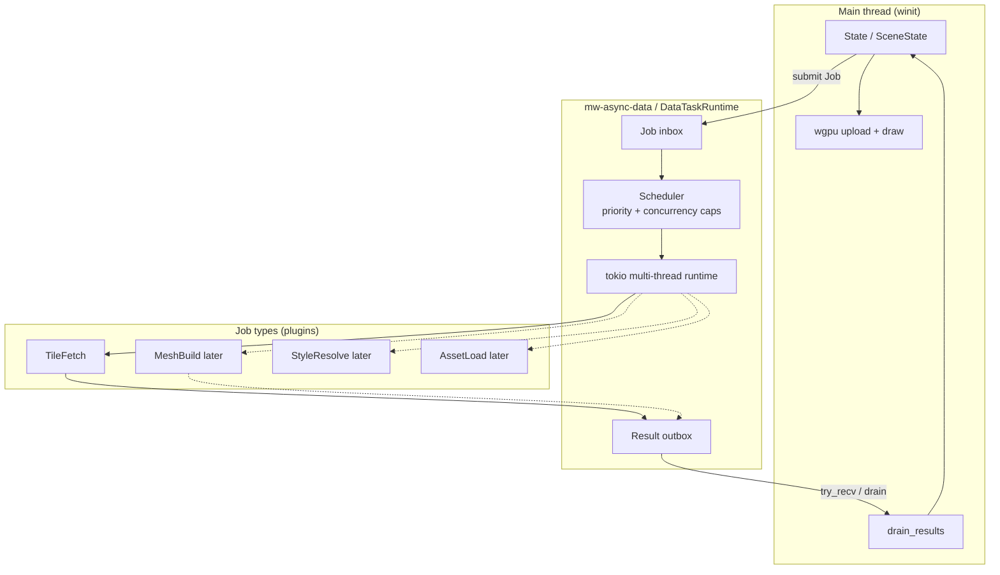
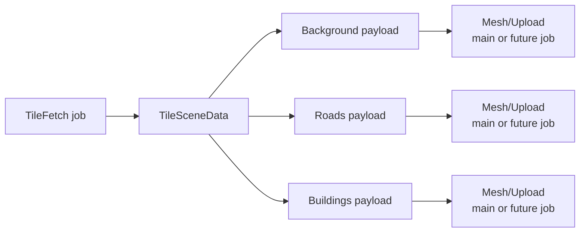

# Phase A: Async Data Task Framework (Tokio)

> Status: design only (not implemented yet)  
> Core idea: **tokio is the shared async framework for all data work**, not a one-off tile downloader  
> First concrete job type: **MVT tile fetch**  
> Related code: `apps/native-viewer/src/state/sceneState.rs`, `crates/mw-provider-mvt`

Chinese version: [`phase-a-async-tile-loader.zh.md`](./phase-a-async-tile-loader.zh.md)

---

## 1. What we mean (important)

“Background tokio tasks” is **not** the whole design.

The design is:

> Build a **general async data-task framework** on tokio.  
> Every kind of expensive/off-main-thread data work becomes a **job type**.  
> Phase A only implements the first job type: **tile download + decode**.

So:

| Layer | Role |
|-------|------|
| **Framework** | runtime, queue, spawn, priority, cancel, result drain |
| **Job types** | TileFetch today; later MeshBuild, StyleResolve, GlyphLoad, … |
| **Main thread** | decide what is needed, drain results, upload GPU, draw |

Tiles are the first customer of the framework — not the framework itself.

---

## 2. Problem today

`SceneState` owns a tokio runtime and calls `block_on(fetch_tile)` on the **winit main thread**.

That couples:

- UI frame loop
- network I/O
- decode
- cache / sticky / merge
- GPU upload

into one path. Adding another async data source later (glyphs, DEM, style JSON, heavy mesh jobs) would repeat the same mistake.

---

## 3. Goals

| Goal | Meaning |
|------|---------|
| Shared async substrate | One tokio runtime + task API for all async data jobs |
| Job-typed work | Each data kind is a typed job, not ad-hoc `spawn` scattered in app code |
| Non-blocking UI | Main thread never `block_on`s network/decode |
| Extensible | New data types plug in without redesigning threading |
| Phase A deliverable | Ship **TileFetch** on top of that framework first |

Non-goals for Phase A:

- config module (Phase B)
- full style/render split (Phase C)
- PBR
- implementing every future job type now

---

## 4. Architecture

### 4.1 Framework vs job types



### 4.2 One tile still contains many map layers

Important: **one HTTP MVT tile** already carries multiple domain layers:

```text
.pbf tile
  ├─ Background fills   (water / landuse / …)
  ├─ Roads              (transportation / …)
  └─ Buildings          (building / …)
```

So Phase A does **not** download background/roads/buildings on three separate HTTP paths.

Instead:

```text
Job: TileFetch(tile_id)
  → bytes
  → decode
  → map to TileSceneData { Background, Roads, Buildings }
  → one TileFetched result
```

Per-type work after that (mesh, style, GPU upload) can become **later job types** or stay on main thread until Phase C.



---

## 5. Framework API sketch

Think of this as a tiny job system, not a tile-only loader.

```rust
/// Shared async data framework.
pub struct DataTaskRuntime { /* tokio Handle, channels, caps */ }

/// Every async data unit of work.
pub enum DataJob {
    TileFetch { tile_id: TileId, priority: u64 },
    // Future examples:
    // MeshBuild { key: MeshKey, features: ... },
    // StyleResolve { zoom: u8, ... },
    // GlyphAtlas { stack: String, range: ... },
}

/// Typed results back to the main thread.
pub enum DataResult {
    TileFetched {
        tile_id: TileId,
        scene: TileSceneData, // already split into Background/Roads/Buildings
        elapsed_ms: f64,
    },
    TileFailed { tile_id: TileId, error: String },
    // Future:
    // MeshReady { key: MeshKey, buffers: ... },
    // StyleReady { ... },
}

impl DataTaskRuntime {
    pub fn new() -> anyhow::Result<Self>;
    pub fn submit(&self, job: DataJob);
    pub fn submit_many(&self, jobs: impl IntoIterator<Item = DataJob>);
    pub fn drain(&self) -> Vec<DataResult>;
    pub fn in_flight(&self) -> usize;
}
```

Main-thread loop stays simple for **any** data type:

```rust
runtime.submit_many(tile_jobs);
for result in runtime.drain() {
    match result {
        DataResult::TileFetched { tile_id, scene, .. } => cache.insert(tile_id, scene),
        DataResult::TileFailed { .. } => { /* log / retry */ }
        // later: MeshReady / StyleReady / ...
    }
}
```

---

## 6. Job-type catalog (now vs later)

| Job type | Phase | Input | Output | Runs on |
|----------|-------|-------|--------|---------|
| **TileFetch** | A (now) | `TileId` | `TileSceneData` (all layers inside) | tokio async (+ maybe `spawn_blocking` for decode) |
| **ProviderInit** | A (now) | config | ready endpoint / error | tokio async |
| MeshBuild | later | features / style params | CPU mesh buffers | `spawn_blocking` or async |
| StyleResolve | later | feature props + zoom | draw params | cheap CPU / async |
| Glyph/AssetLoad | later | URL / key | bytes / atlas | tokio async |
| DEM / Raster tile | later | tile id | image bytes | tokio async |

Phase A only **implements** TileFetch (+ ProviderInit), but the **framework shape** already assumes more job types.

---

## 7. Rust capabilities (framework level)

| Capability | Framework role |
|------------|----------------|
| **`tokio` multi-thread runtime** | Shared executor for all data jobs |
| **`tokio::spawn`** | Run each accepted job |
| **`tokio::sync::Semaphore`** | Per-job-type or global concurrency caps |
| **channels (`mpsc` / crossbeam)** | Job inbox + result outbox |
| **`Arc`** | Share runtime handle / provider with tasks |
| **enums `DataJob` / `DataResult`** | Typed extensibility for every data kind |
| **`Send + 'static`** | Jobs/results cross threads safely |
| **optional `spawn_blocking`** | CPU-heavy decode/mesh without stalling async workers |

This is why we say tokio tasks are a **framework**: they provide scheduling + concurrency for many job kinds, not only tiles.

---

## 8. Trade-offs

### 8.1 General framework vs tile-only loader

| | General `DataTaskRuntime` | Tile-only `TileLoader` |
|--|---------------------------|-------------------------|
| Extensibility | Add job types cleanly | New data → new ad-hoc thread code |
| Upfront design | Slightly more abstract | Faster to hack |
| Risk | Over-design if unused | Re-architect later |

**Decision:** design the framework now; implement only TileFetch in Phase A.

### 8.2 One TileFetch vs separate jobs per map layer

| | One TileFetch → full `TileSceneData` | Separate BackgroundFetch / RoadFetch / BuildingFetch |
|--|--------------------------------------|------------------------------------------------------|
| Network | 1 HTTP GET per tile | Wasteful / usually impossible (same .pbf) |
| Matches MVT | Yes | No for MapTiler/OpenMapTiles |
| Per-type priority | After split, via later MeshBuild jobs | Fake at download layer |

**Decision:** download stays **tile-scoped**. Per-type differentiation happens **after** decode (mesh/style/upload jobs later).

### 8.3 Where concurrency caps live

| | Global cap only | Cap per job type |
|--|-----------------|------------------|
| Simple | Yes | No |
| Fairness | Tile flood can starve other jobs | Better when MeshBuild arrives |

**Decision:** Phase A = global + TileFetch cap. Add per-type caps when second job type lands.

### 8.4 Keep GPU on main thread

Still true: framework does **data** work. `wgpu` Device/Queue stay on the UI/render thread. Future `MeshBuild` can return CPU buffers; upload remains main-thread.

---

## 9. What Phase A changes in the app

1. Extract `DataTaskRuntime` (new crate or module).
2. Implement `DataJob::TileFetch` / `DataResult::TileFetched`.
3. `SceneState` submits tile jobs + drains results (no `block_on`).
4. Sticky / merge / upload stay on main thread.
5. Document how Background / Roads / Buildings arrive inside one tile result (not three downloads).

### Acceptance

- [ ] Frame loop has no `block_on`
- [ ] API is job-typed (`DataJob` / `DataResult`), not tile-only names forever
- [ ] TileFetch returns full scene with Background + Roads + Buildings
- [ ] UI stays responsive while tiles stream in
- [ ] Adding a second job type later does not require a new threading model

---

## 10. Summary

- **Framework:** tokio-powered `DataTaskRuntime` for all async data jobs  
- **First job:** `TileFetch`  
- **Map layer types** (Background / Roads / Buildings): split **inside** a fetched tile, then processed by later stages/jobs  
- **Main thread:** decide, drain, upload, draw  

One line:

> **Tokio hosts the data-task framework; each data kind is a job type; tiles are only the first job.**
