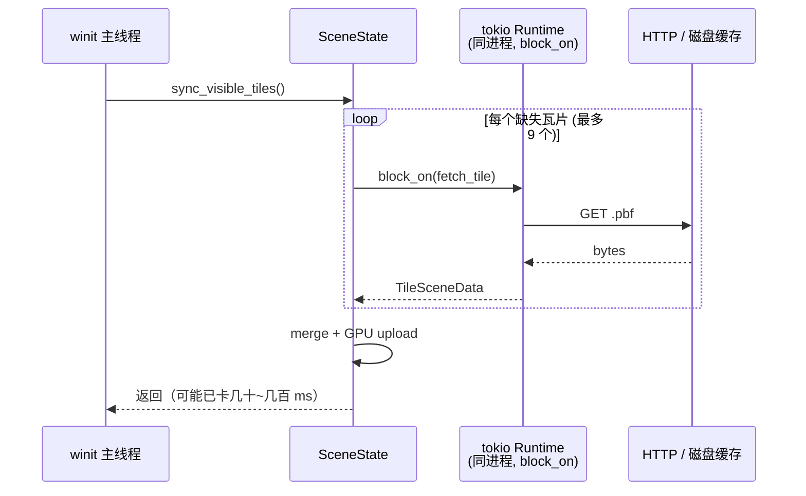
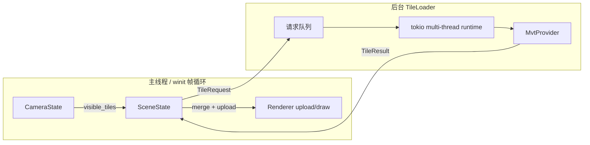
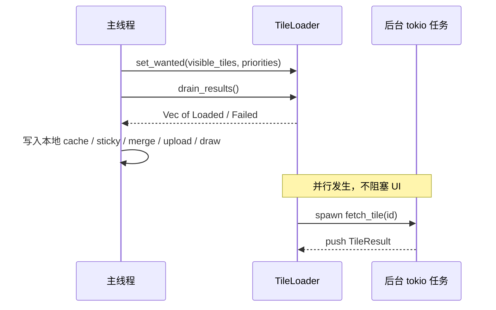

# Phase A：异步瓦片加载器设计

> 状态：设计稿（尚未实现）  
> 范围：把瓦片下载移出 winit 渲染线程  
> 相关代码：`apps/native-viewer/src/state/sceneState.rs`、`crates/mw-provider-mvt`

---

## 1. 问题

当前每帧在 `State::render()` 里调用 `SceneState::sync_visible_tiles()`，内部对缺失瓦片执行：

```text
tokio::Runtime::block_on(provider.fetch_tile(tile_id))
```

这发生在 **winit 主线程** 上。HTTP / 解码一慢，就会：

- 卡顿、掉帧
- 相机拖拽/旋转不跟手
- 性能日志里出现 “blocked frames”

`mw-provider-mvt` 本身已经是 async 的；真正的问题是 **调用方式**：用同步 `block_on` 把异步能力堵死在主线程上。

---

## 2. 目标

| 目标 | 说明 |
|------|------|
| 主线程不阻塞 | `RedrawRequested` 里禁止 `block_on` 网络 I/O |
| 后台下载 | HTTP + MVT decode 在独立异步运行时执行 |
| 非阻塞交接 | 主线程只发请求、收结果 |
| 行为尽量不变 | 仍保留 sticky 可见集、同 zoom 缓存、每帧限流 |

非目标（本阶段不做）：

- 配置模块（Phase B）
- 渲染/样式抽象（Phase C）
- PBR / 材质系统

---

## 3. 架构图

### 3.1 现状（阻塞）



### 3.2 目标（异步加载器）



### 3.3 每帧时序



---

## 4. 建议模块边界

```text
apps/native-viewer/
  state/sceneState.rs     # 变薄：缓存、sticky、merge、upload
  state/state.rs          # 帧循环：request → drain → render

crates/mw-provider-mvt/   # 保持不变：纯 async fetch/decode/map
  或
crates/mw-tile-loader/    # 新建（推荐）：后台调度 + 通道
```

推荐新建 `mw-tile-loader`（或暂放在 `mw-provider-mvt` 的 `loader` 模块），避免继续把调度逻辑塞进 `SceneState`。

### 4.1 对外 API 草图

```rust
pub struct TileLoader { /* 私有：runtime handle + channels */ }

pub enum TileRequest {
    EnsureProvider,
    Fetch(TileId),
    CancelExcept(HashSet<TileId>), // 可选：取消已离开视野的 in-flight
}

pub enum TileResult {
    ProviderReady { endpoint: String },
    ProviderFailed { error: String },
    Loaded { tile_id: TileId, scene: TileSceneData, elapsed_ms: f64 },
    Failed { tile_id: TileId, error: String },
}

impl TileLoader {
    pub fn new(config: MvtProviderConfig) -> anyhow::Result<Self>;
    pub fn request_tiles(&self, tiles: &[(TileId, u64 /*priority*/)]);
    pub fn drain_results(&self) -> Vec<TileResult>;
    pub fn in_flight(&self) -> usize;
}
```

主线程伪代码：

```rust
loader.request_tiles(&missing_prioritized);
for result in loader.drain_results() {
    match result {
        TileResult::Loaded { tile_id, scene, .. } => cache.insert(tile_id, scene),
        TileResult::Failed { .. } => { /* 记日志，下帧可重试 */ }
        _ => {}
    }
}
// merge + upload 仍在主线程（需要 wgpu Device/Queue）
```

---

## 5. 使用的 Rust / 生态能力

| 能力 | 用途 | 为什么用它 |
|------|------|------------|
| **`tokio` multi-thread runtime** | 后台执行 HTTP + decode | 已有依赖；`reqwest` 需要 tokio |
| **`tokio::spawn` / `JoinHandle`** | 每个瓦片一个异步任务 | 多瓦片可并行，而不是串行 `block_on` |
| **`std::sync::mpsc` 或 `crossbeam_channel` 或 `tokio::sync::mpsc`** | 主线程 ↔ 加载器消息 | 非阻塞 `try_recv` / `drain` 适合帧循环 |
| **`Arc<MvtProvider>`** | 多任务共享 provider | provider 可 clone / 线程安全后共享 |
| **`Arc<AtomicUsize>` / 信号量** | 限制 in-flight 数量 | 替代今天的 `MAX_TILES_PER_SYNC`，但改为并发上限 |
| **`Send + 'static` 边界** | 跨线程移动 `TileSceneData`** | 强制场景数据可安全交接 |
| **不在主线程 `block_on`** | 保活帧率 | Phase A 的核心约束 |

### 5.1 通道选型建议

| 选项 | 优点 | 缺点 |
|------|------|------|
| `std::sync::mpsc` | 标准库，简单 | 多生产者略别扭；无内置 bounded 背压语义（可用 try_send 模式） |
| `crossbeam_channel` | 好用、可 select | 多一个依赖 |
| `tokio::sync::mpsc` | 与 tokio 一体 | 主线程要用 `try_recv`，不要在帧循环里 `.await` |

**建议 Phase A**：`std::sync::mpsc` 或 `crossbeam_channel`，主线程只 `try_recv` 排空队列。

### 5.2 GPU 仍留在主线程

`wgpu::Device` / `Queue` **不要**丢进下载线程。

原因：

- 多数 wgpu 用法默认与创建它们的线程亲和更安全、更简单
- upload 需要与当前 surface/frame 生命周期协调
- Phase A 只解决网络卡顿；mesh upload 通常比 HTTP 便宜得多

---

## 6. 权衡（Trade-offs）

### 6.1 异步加载器 vs 继续 `block_on`

| | 异步加载器 | 现状 `block_on` |
|--|-----------|-----------------|
| 帧时间 | 稳定 | 网络一抖就卡 |
| 复杂度 | 通道 + 生命周期 | 代码短 |
| 调试 | 竞态、乱序结果 | 顺序直观 |
| 取消 | 需要显式策略 | 天然“这帧做完” |

**结论**：交互式地图必须选异步；复杂度可接受。

### 6.2 每瓦片一个任务 vs 单 worker 队列

| | 每瓦片 spawn | 单 worker 串行拉 |
|--|-------------|------------------|
| 吞吐 | 高（并行 HTTP） | 低 |
| 限流 | 需要 semaphore | 天然限流 |
| 实现 | 稍复杂 | 简单 |

**结论**：用 **有界并发**（例如同时最多 4~8 个 in-flight），而不是无限 spawn，也不是完全串行。

### 6.3 结果直接进主线程 cache vs 共享 `Mutex<HashMap>`

| | 通道回传主线程 | 共享 Mutex 缓存 |
|--|----------------|-----------------|
| 所有权 | 清晰 | 锁竞争、难推理 |
| wgpu upload | 自然在主线程 | 仍要拷回主线程或持锁 upload |
| 取消/sticky | 主线程独家决策 | 两端都要懂策略 |

**结论**：下载线程只产出 `TileResult`；**cache / sticky / merge 仍归主线程**（保持现有 `SceneState` 语义）。

### 6.4 取消策略

相机快速移动时，旧请求会过时。

| 策略 | 说明 |
|------|------|
| **A. 忽略过时结果**（推荐先做） | 结果回来时若 `tile_id` 不在 wanted/sticky，丢弃 |
| B. 主动 cancel JoinHandle | 更省带宽，实现更重 |
| C. 世代号 epoch | `request_gen` 不匹配则丢弃 |

Phase A 采用 **A + 可选 epoch**，足够且稳。

### 6.5 新 crate vs 放进现有 crate

| | `mw-tile-loader` 新 crate | 放进 `mw-provider-mvt` | 放进 native-viewer |
|--|---------------------------|------------------------|-------------------|
| 复用 | web-viewer 也能用 | 可以 | 难复用 |
| 依赖方向 | 依赖 provider | provider 变重 | app 继续臃肿 |
| 清晰度 | 边界最好 | 中等 | 差 |

**结论**：优先独立模块/crate；若想少动 workspace，可先作为 `mw-provider-mvt::loader`，之后再拆。

---

## 7. 主线程仍负责什么

加载器 **不** 接管这些逻辑（避免 Phase A 范围爆炸）：

1. `CameraState::visible_tiles()` 计算
2. sticky 可见集（wanted 未完成时保留旧同 zoom 瓦片）
3. 按 zoom 修剪缓存
4. `merge_tiles_into_scene_relative`
5. mesh origin rebase
6. `Renderer::upload_tile` / draw

加载器只负责：**按优先级取 tile，并异步交还 `TileSceneData`**。

---

## 8. 迁移步骤

1. 引入 `TileLoader`，内部持有 tokio runtime（从 `SceneState` 挪出）
2. 把 `ensure_provider` / `fetch_one_tile` 改成异步消息
3. `sync_visible_tiles` 改为：
   - 算 missing
   - `request_tiles`
   - `drain_results` 填 cache
   - 若 cache 有变化再 merge/upload
4. 删除渲染路径上的所有 `block_on`
5. 用快速拖拽/缩放验证：UI 流畅，瓦片稍后补齐

### 验收标准

- [ ] 帧循环中无 `block_on`
- [ ] 拖拽时输入延迟不明显升高
- [ ] 瓦片仍会加载并显示（允许延迟 1~N 帧）
- [ ] 同 zoom sticky 行为保持
- [ ] 失败瓦片打日志且不崩，之后可重试

---

## 9. 风险与缓解

| 风险 | 缓解 |
|------|------|
| 结果乱序到达 | `TileId` 键入 HashMap；merge 只看集合不看顺序 |
| 内存涨（飞回过多结果） | bounded 结果队列；丢掉非 wanted 结果 |
| 重复请求同一瓦片 | `in_flight: HashSet<TileId>` 去重 |
| 关闭窗口时任务还在跑 | `Drop` 时关闭发送端；任务检测断开后退出 |
| decode 占 CPU | tokio 上重 CPU 可考虑 `spawn_blocking`（后续优化） |

---

## 10. 小结

Phase A 用 Rust 的 **所有权 + 通道 + tokio 任务** 把 I/O 移出 UI 线程，而不是在地图应用里继续 `block_on`。

一句话：

> **主线程决策与绘制；后台线程下载与解码；通过消息会合。**

英文版见：[`phase-a-async-tile-loader.en.md`](./phase-a-async-tile-loader.en.md)
