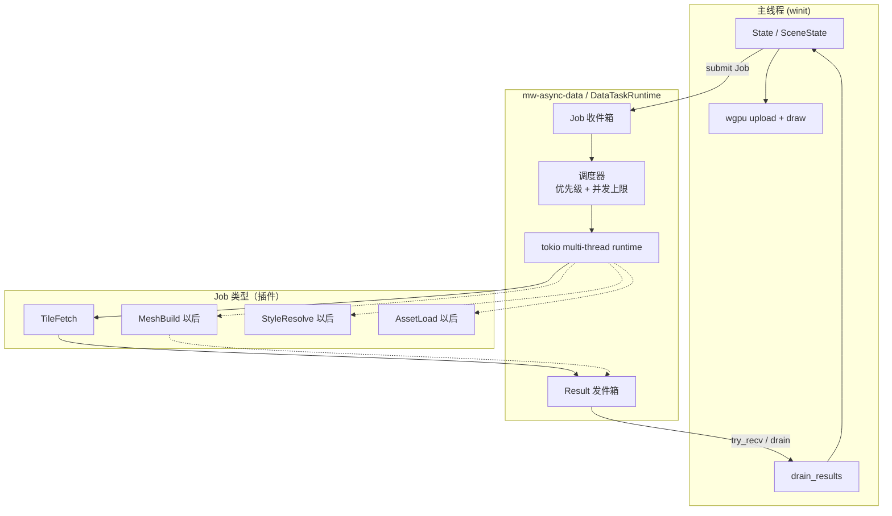
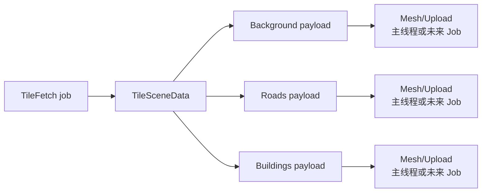

# Phase A：异步数据任务框架（Tokio）

> 状态：设计稿（尚未实现）  
> 核心想法：**tokio 是所有数据工作共用的异步框架**，不是一次性的瓦片下载器  
> 第一个具体任务类型：**MVT 瓦片拉取**  
> 相关代码：`apps/native-viewer/src/state/sceneState.rs`、`crates/mw-provider-mvt`

英文版：[`phase-a-async-tile-loader.en.md`](./phase-a-async-tile-loader.en.md)

---

## 1. 先说清楚（重要）

“Background tokio tasks” **不是**完整设计。

真正的设计是：

> 在 tokio 上建一个 **通用异步数据任务框架**。  
> 每一种昂贵的、不该在主线程做的数据工作，都变成一种 **Job 类型**。  
> Phase A 只实现第一种 Job：**瓦片下载 + 解码**。

所以：

| 层次 | 职责 |
|------|------|
| **框架** | runtime、队列、spawn、优先级、取消、结果回收 |
| **Job 类型** | 今天是 TileFetch；以后是 MeshBuild、StyleResolve、GlyphLoad… |
| **主线程** | 决定需要什么、drain 结果、上传 GPU、绘制 |

瓦片是框架的第一个客户，**不是**框架本身。

---

## 2. 现状问题

`SceneState` 自己握着 tokio runtime，在 **winit 主线程** 上 `block_on(fetch_tile)`。

这把下面这些全耦在一条路径里：

- UI 帧循环
- 网络 I/O
- 解码
- cache / sticky / merge
- GPU upload

以后再加别的异步数据（字体、DEM、style JSON、重 mesh 任务）会重复踩坑。

---

## 3. 目标

| 目标 | 含义 |
|------|------|
| 共享异步底座 | 一套 tokio runtime + 任务 API，服务所有异步数据工作 |
| 按 Job 分类 | 每种数据是类型化任务，而不是 app 里到处 `spawn` |
| 主线程不阻塞 | 主线程不对网络/解码 `block_on` |
| 可扩展 | 新数据类型不用重做线程模型 |
| Phase A 交付物 | 先在这套框架上跑通 **TileFetch** |

本阶段非目标：

- 配置模块（Phase B）
- 完整样式/渲染拆分（Phase C）
- PBR
- 现在就把未来所有 Job 都实现完

---

## 4. 架构

### 4.1 框架 vs Job 类型



### 4.2 一张瓦片里仍有多种地图图层

重要：**一次 HTTP 拉到的 MVT** 已经包含多种领域图层：

```text
.pbf tile
  ├─ Background fills   (water / landuse / …)
  ├─ Roads              (transportation / …)
  └─ Buildings          (building / …)
```

所以 Phase A **不会**给 background / roads / buildings 各开一条 HTTP。

而是：

```text
Job: TileFetch(tile_id)
  → bytes
  → decode
  → map 成 TileSceneData { Background, Roads, Buildings }
  → 一个 TileFetched 结果
```

之后的分类型工作（mesh、style、GPU upload）可以变成 **后续 Job**，或暂时仍留在主线程直到 Phase C。



---

## 5. 框架 API 草图

把它想成一个小 Job 系统，而不是“只会下瓦片的 Loader”。

```rust
/// 共享异步数据框架。
pub struct DataTaskRuntime { /* tokio Handle, channels, caps */ }

/// 每一个异步数据工作单元。
pub enum DataJob {
    TileFetch { tile_id: TileId, priority: u64 },
    // 未来示例：
    // MeshBuild { key: MeshKey, features: ... },
    // StyleResolve { zoom: u8, ... },
    // GlyphAtlas { stack: String, range: ... },
}

/// 回到主线程的类型化结果。
pub enum DataResult {
    TileFetched {
        tile_id: TileId,
        scene: TileSceneData, // 已拆成 Background/Roads/Buildings
        elapsed_ms: f64,
    },
    TileFailed { tile_id: TileId, error: String },
    // 未来：
    // MeshReady { key: MeshKey, buffers: ... },
    // StyleReady { ... },
}

impl DataTaskRuntime {
    pub fn new() -> anyhow::Result<Self>;
    pub fn submit(&self, job: DataJob);
    pub fn submit_many(&self, jobs: impl IntoIterator<Item = DataJob>);
    pub fn drain(&self) -> Vec<DataResult>;
    pub fn in_flight(&self) -> usize;
}
```

主线程对 **任何** 数据类型都同一套循环：

```rust
runtime.submit_many(tile_jobs);
for result in runtime.drain() {
    match result {
        DataResult::TileFetched { tile_id, scene, .. } => cache.insert(tile_id, scene),
        DataResult::TileFailed { .. } => { /* log / retry */ }
        // 以后: MeshReady / StyleReady / ...
    }
}
```

---

## 6. Job 类型目录（现在 vs 以后）

| Job 类型 | 阶段 | 输入 | 输出 | 跑在哪里 |
|----------|------|------|------|----------|
| **TileFetch** | A（现在） | `TileId` | `TileSceneData`（内含各图层） | tokio async（decode 可 `spawn_blocking`） |
| **ProviderInit** | A（现在） | config | endpoint 就绪 / 错误 | tokio async |
| MeshBuild | 以后 | features / style | CPU mesh buffer | `spawn_blocking` 或 async |
| StyleResolve | 以后 | 属性 + zoom | draw params | 轻量 CPU / async |
| Glyph/AssetLoad | 以后 | URL / key | bytes / atlas | tokio async |
| DEM / Raster tile | 以后 | tile id | 图像 bytes | tokio async |

Phase A **只实现** TileFetch（+ ProviderInit），但框架形态已经按“多种 Job”来设计。

---

## 7. Rust 能力（框架层）

| 能力 | 在框架里的角色 |
|------|----------------|
| **`tokio` multi-thread runtime** | 所有数据 Job 的共享执行器 |
| **`tokio::spawn`** | 跑每个被接受的 Job |
| **`tokio::sync::Semaphore`** | 全局或按 Job 类型的并发上限 |
| **channel（`mpsc` / crossbeam）** | Job 收件箱 + Result 发件箱 |
| **`Arc`** | 任务间共享 runtime handle / provider |
| **枚举 `DataJob` / `DataResult`** | 为每种数据提供类型化扩展点 |
| **`Send + 'static`** | Job/结果安全跨线程 |
| **可选 `spawn_blocking`** | 重 CPU 的 decode/mesh，不堵异步 worker |

所以我们说 tokio tasks 是 **框架**：它给很多种数据工作提供调度与并发，而不是只服务瓦片。

---

## 8. 权衡

### 8.1 通用框架 vs 只写 TileLoader

| | 通用 `DataTaskRuntime` | 只做 `TileLoader` |
|--|------------------------|-------------------|
| 扩展性 | 加 Job 类型很干净 | 新数据又要新造线程胶水 |
| 前期设计 | 稍抽象 | 改得快 |
| 风险 | 用不上会显得过度设计 | 以后还得重构线程模型 |

**结论：** 现在就把框架定好；Phase A 只实现 TileFetch。

### 8.2 一个 TileFetch vs 按地图图层拆下载

| | 一个 TileFetch → 完整 `TileSceneData` | Background/Road/Building 各下一遍 |
|--|--------------------------------------|-----------------------------------|
| 网络 | 每瓦片 1 次 GET | 浪费 / 对 MVT 通常做不到 |
| 符合 MVT | 是 | MapTiler/OpenMapTiles 不适合 |
| 分类型优先级 | decode 之后用后续 MeshBuild 等 Job | 在下载层假拆 |

**结论：** 下载仍以 **瓦片** 为粒度。分类型差异放在 decode **之后**（mesh/style/upload Job）。

### 8.3 并发上限放哪

| | 只有全局上限 | 按 Job 类型分别限流 |
|--|--------------|---------------------|
| 简单 | 是 | 否 |
| 公平 | 瓦片洪峰可能挤占别的 Job | 第二种 Job 出现后更合理 |

**结论：** Phase A = 全局 + TileFetch 上限；第二种 Job 落地后再加分类型限流。

### 8.4 GPU 仍在主线程

仍然成立：框架做 **数据** 工作。`wgpu` Device/Queue 留在 UI/渲染线程。未来 `MeshBuild` 可以回传 CPU buffer；upload 仍在主线程。

---

## 9. Phase A 在应用里改什么

1. 抽出 `DataTaskRuntime`（新 crate 或模块）。
2. 实现 `DataJob::TileFetch` / `DataResult::TileFetched`。
3. `SceneState` 只 submit + drain（去掉 `block_on`）。
4. sticky / merge / upload 仍在主线程。
5. 写清楚：Background / Roads / Buildings 来自同一次瓦片结果，不是三次下载。

### 验收

- [ ] 帧循环无 `block_on`
- [ ] API 是 Job 类型（`DataJob` / `DataResult`），不是永远叫 TileLoader
- [ ] TileFetch 返回含 Background + Roads + Buildings 的完整 scene
- [ ] 拖拽时 UI 流畅，瓦片稍后补齐
- [ ] 以后加第二种 Job 不需要新的线程模型

---

## 10. 小结

- **框架：** 基于 tokio 的 `DataTaskRuntime`，服务所有异步数据 Job  
- **第一个 Job：** `TileFetch`  
- **地图图层类型**（Background / Roads / Buildings）：在 **已拉取的瓦片内部** 拆分，再进入后续阶段/Job  
- **主线程：** 决策、drain、upload、绘制  

一句话：

> **Tokio 承载数据任务框架；每种数据是一种 Job；瓦片只是第一种 Job。**
